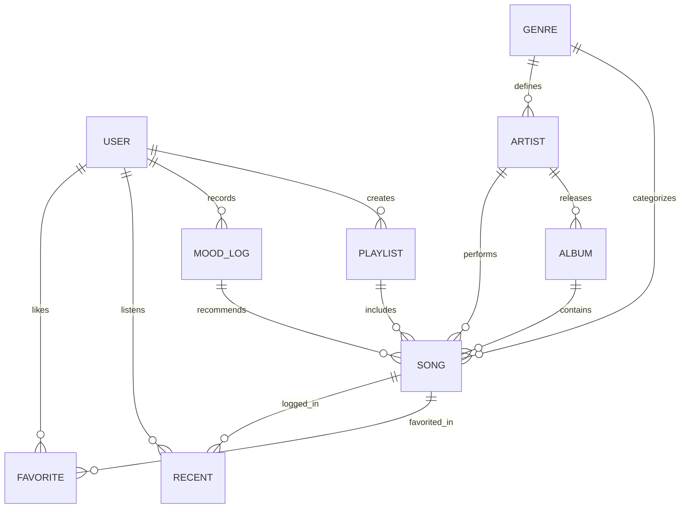

# 🎧 Moodfly - Biometric AI Music Player

> **"Let your vibe curate your soundtrack effortlessly."**  
> An atmospheric, intelligent audio streaming platform engineered for emotionally resonant listening. Moodfly pairs biometric facial emotion recognition with real-time audio playback, curated playlists, and a high-fidelity dark obsidian aesthetic.

---

## 📋 Table of Contents
- [Project Vision & Overview](#-project-vision--overview)
- [UI & Feature Matrix (Stitch Design System)](#-ui--feature-matrix-stitch-design-system)
- [System Architecture](#-system-architecture)
- [Database Schema & Data Modeling (Mongoose)](#-database-schema--data-modeling-mongoose)
  - [Entity Relationship Diagram](#entity-relationship-diagram)
  - [Collection Specifications](#collection-specifications)
- [API Route Specifications (Planned)](#-api-route-specifications-planned)
- [Design System & Aesthetics](#-design-system--aesthetics)
- [Project Directory Layout](#-project-directory-layout)
- [Development Roadmap & Checklist](#-development-roadmap--checklist)

---

## 🌟 Project Vision & Overview

Moodfly transforms the music listening experience from passive selection to intuitive, emotion-aligned curation:
- **Biometric Mood Detection**: Uses the user's camera feed to analyze facial emotion telemetry (Joy, Calm, Surprise, Sorrow, Energy) and curate instant playlists tuned to their psychological frequency.
- **Dynamic Mood Sync**: Playlists that automatically reorganize based on live emotion state changes.
- **Atmospheric Audio Deck**: High-fidelity dark mode with bioluminescent neon accents, responsive audio spectrum equalizers, and interactive spinning vinyl record animations.
- **Complete Streaming Hub**: Full catalogue containing songs, verified artists, albums, curated genres, custom playlists, recent listening history, and favorites.

---

## 🎨 UI & Feature Matrix (Stitch Design System)

Extracted directly from the Stitch high-fidelity UI specifications (`projects/1640889389413669007`):

### 1. 📷 Mood Detection Studio (`/detect-mood`)
- **Cinematic Viewfinder**: Centered webcam viewfinder with ambient glowing reticle and telemetry overlay.
- **Real-Time Emotion HUD**: Emotion confidence display (e.g. `Confidence: 94%`, `Mood: Uplifted & Vibrant ✨`).
- **Scan & Auto-Sync**: One-click "Detect Mood" button triggering facial telemetry analysis and returning matched audio recommendations.
- **Recommended Songs Deck**: Instant song matches based on detected energy level and mood tag.

### 2. 🏠 Home & Dashboard (`/`)
- **Hero Featured Release**: Dynamic banner with listen now action, play count (`300 Plays`), and favorite action.
- **Top Artists Carousel**: Round avatars with verified badges and monthly listeners (`192M Monthly`).
- **Explore Genres Grid**: Vibe-based genre tiles with glow effects:
  - **Hip Hop**: *Rhythm* (Cyan accent)
  - **Acoustic**: *Organic* (Emerald accent)
  - **Ambient**: *Atmosphere* (Violet accent)
  - **EDM**: *Energy*
  - **Lo-Fi**: *Relaxed*
  - **Bollywood**: *Soul*
- **Top Chart Song List**: Numbered track rows with active equalizer animations, duration, and instant favorites.
- **Live Audio Deck (Right Sidebar)**: Spinning vinyl disc artwork, soundwave visualizer bars, seekbar scrubber, and dedicated playback controls.

### 3. 🎵 My Playlist & Create Modal Flow (`/playlists`)
- **Hero Banner**: Large album cover art, curator metadata (`Alex M. • 24 songs • 1 hr 38 min`), and play all actions.
- **Create Playlist Modal**:
  - `Playlist Name` input.
  - `Description` textarea.
  - `Public Playlist` toggle.
  - `Mood Sync Dynamic` toggle: *"Auto-sort tracks using webcam emotion scan"*.
- **Table Track Listing**: Number, Title & Artist thumbnail, Album title, Date added, and Duration.

### 4. 🎛️ Persistent Master Bottom Player
- Track thumbnail & title/artist info with favorite toggle.
- Scrub bar with current timestamp (`2:04 / 3:45`) and hover thumb bloom.
- Central controls: Shuffle, Previous, Play/Pause with emerald glow, Next, Repeat.
- Volume slider & Queue list toggle.

---

## 🏛️ System Architecture

```
                               ┌────────────────────────┐
                               │  Moodfly Frontend UI   │
                               │  (Vite / React / HTML) │
                               └───────────┬────────────┘
                                           │
                    REST API Requests      │ Webcam Telemetry Payload
                    (JWT Auth, Audio, CRUD)│ (Emotion Vector / Mood Scan)
                                           ▼
                               ┌────────────────────────┐
                               │   Moodfly Node/Express │
                               │      Backend Core      │
                               └───────────┬────────────┘
                                           │
                   ┌───────────────────────┼───────────────────────┐
                   ▼                       ▼                       ▼
       ┌──────────────────────┐ ┌──────────────────────┐ ┌──────────────────────┐
       │   MongoDB Database   │ │   AI / Mood Engine   │ │ Cloud Media Storage  │
       │  (Mongoose Schemas)  │ │ (Telemetry -> Mood)  │ │ (Songs, Covers, Art) │
       └──────────────────────┘ └──────────────────────┘ └──────────────────────┘
```

---

## 🗄️ Database Schema & Data Modeling (Mongoose)

All models reside under `backend/src/models/` and are built using **Mongoose** for MongoDB.

### Entity Relationship Diagram



---

### Collection Specifications

#### 1. `User` (`user.model.js`)
Stores listener accounts, preferences, and permissions.
- `name`: `String` (required, trimmed)
- `email`: `String` (required, unique, validated email format)
- `password`: `String` (required, `select: false` for security)
- `avatar`: `String` (profile photo URL)
- `role`: `String` (`user`, `artist`, `admin`)
- `preferences`:
  - `favoriteGenres`: `[ObjectId -> Genre]`
  - `preferredMoods`: `[String]`
  - `webcamMoodDetectionEnabled`: `Boolean` (default: `true`)
- `timestamps`: `true` (`createdAt`, `updatedAt`)

#### 2. `Artist` (`artist.model.js`)
Represents musicians and bands with verified telemetry.
- `name`: `String` (required, unique, indexed)
- `bio`: `String`
- `avatar`: `String` (required image URL)
- `bannerImage`: `String`
- `monthlyListeners`: `Number` (e.g. `192000000`)
- `monthlyListenersDisplay`: `String` (e.g. `"192M Monthly"`)
- `isVerified`: `Boolean` (default: `true`)
- `genres`: `[ObjectId -> Genre]`
- `socialLinks`: `{ spotify, instagram, youtube, twitter }`
- `timestamps`: `true`

#### 3. `Genre` (`genre.model.js`)
Categorizes music with visual styling tokens and vibe descriptors.
- `name`: `String` (required, unique, indexed - e.g. "Acoustic", "EDM", "Bollywood")
- `vibeDescriptor`: `String` (e.g. "Rhythm", "Organic", "Atmosphere", "Energy", "Relaxed", "Soul")
- `accentColor`: `String` (Hex color for UI card glow, e.g. `#10b981`, `#06b6d4`, `#a855f7`)
- `coverImage`: `String`
- `isPopular`: `Boolean`
- `timestamps`: `true`

#### 4. `Album` (`album.model.js`)
Discography groupings for songs.
- `title`: `String` (required, indexed)
- `artist`: `ObjectId -> Artist` (required)
- `featuredArtists`: `[ObjectId -> Artist]`
- `coverImage`: `String` (required)
- `releaseYear`: `Number`
- `releaseDate`: `Date`
- `genre`: `ObjectId -> Genre`
- `songs`: `[ObjectId -> Song]`
- `totalTracks`: `Number`
- `timestamps`: `true`

#### 5. `Song` (`song.model.js`)
Primary audio track entity loaded into playback queues.
- `title`: `String` (required, indexed)
- `primaryArtist`: `ObjectId -> Artist` (required)
- `featuredArtists`: `[ObjectId -> Artist]`
- `artistNames`: `String` (denormalized string e.g. `"Arijit Singh, Pritam"` for zero-lookup rendering)
- `album`: `ObjectId -> Album`
- `albumTitle`: `String`
- `duration`: `Number` (duration in seconds, e.g. `268`)
- `durationFormatted`: `String` (pre-calculated `"4:28"` via pre-save hook)
- `audioUrl`: `String` (required streaming URL)
- `coverImage`: `String` (required artwork URL)
- `lyrics`: `String`
- `genres`: `[ObjectId -> Genre]`
- `moodTags`: `[String]` (indexed, e.g. `['Euphoric', 'Calm', 'Vibrant', 'Energetic', 'Lo-Fi', 'Melancholic', 'Relaxed', 'Focus']`)
- `energyLevel`: `Number` (`1` to `10`)
- `playCount`: `Number` (default: `0`, indexed)
- `isFeatured`: `Boolean` (default: `false`)
- `featuredSubtitle`: `String` (e.g. `"Spiritual Resonance • 2024"`)
- `trendingRank`: `Number`
- `trendingBadge`: `String` (e.g. `"Trending #1 Today"`)
- `timestamps`: `true`

#### 6. `Playlist` (`playlist.model.js`)
User-created and curated collections with biometric sync support.
- `name`: `String` (required, max 100 chars)
- `description`: `String`
- `coverImage`: `String`
- `user`: `ObjectId -> User` (required creator, indexed)
- `songs`: `[{ song: ObjectId -> Song, addedAt: Date }]`
- `isPublic`: `Boolean` (default: `true`, matching modal toggle)
- `moodSyncDynamic`: `Boolean` (default: `false`, auto-sorts tracks by webcam emotion)
- `sidebarIcon`: `String` (icon name for sidebar: `graphic_eq`, `nightlight`, `bolt`)
- `accentColor`: `String`
- `targetMood`: `String` (e.g. `"Chill Vibes"`, `"Gym Boost"`)
- `virtual: totalSongs`: auto-computes number of items
- `timestamps`: `true`

#### 7. `MoodLog` (`moodLog.model.js`)
Logs biometric emotion detection events from face-api.js or user input.
- `user`: `ObjectId -> User` (optional for guest, indexed for authenticated)
- `mood`: `String` (required, indexed, e.g. `"happy"`, `"sad"`, `"neutral"`, `"surprised"`, `"angry"`, `"fearful"`, `"disgusted"`)
- `emoji`: `String` (e.g. `✨`, `⚡`, `🌙`, `🧘`, `🎸`, `😊`, `😢`)
- `confidence`: `Number` (0.0 to 1.0, default: `1`)
- `recommendedSongs`: `[ObjectId -> Song]` (songs matched to this mood)
- `selectedSong`: `ObjectId -> Song` (the song chosen by user)
- `detectionSource`: `String` (`webcam_scan`, `manual_selection`, `audio_telemetry`)
- `timestamps`: `true`

#### 8. `Recent` (`recent.model.js`)
Powers the "Recents" library tab and listening history.
- `user`: `ObjectId -> User` (required, indexed)
- `song`: `ObjectId -> Song` (required)
- `playedDuration`: `Number` (seconds played)
- `completed`: `Boolean`
- `contextMood`: `String` (active mood at time of playback)
- `playedAt`: `Date` (default: `Date.now`, indexed)
- `compound index`: `{ user: 1, playedAt: -1 }` for rapid history queries

#### 9. `Favorite` (`favorite.model.js`)
Instant like/unlike tracking for the heart buttons and "Favorite" library tab.
- `user`: `ObjectId -> User` (required, indexed)
- `song`: `ObjectId -> Song` (required)
- `favoritedAt`: `Date`
- `unique compound index`: `{ user: 1, song: 1 }` (prevents duplicates, enables fast toggling)

---

## 📡 API Route Specifications (Planned)

```
Auth & Profile
POST   /api/v1/auth/register          - Create account
POST   /api/v1/auth/login             - Authenticate & get JWT token
GET    /api/v1/auth/me                - Get current user profile & preferences

Mood & AI Detection
POST   /api/v1/mood/detect            - Send webcam emotion telemetry -> return mood & recommended songs
GET    /api/v1/mood/history           - Get user's past biometric mood logs
GET    /api/v1/mood/vibe/:tag         - Get tracks matching specific vibe / emotion tag

Music Catalogue
GET    /api/v1/songs                  - Browse songs with filters (search, genre, mood, trending)
GET    /api/v1/songs/featured         - Get trending release (#1 hero song)
GET    /api/v1/songs/:id              - Get song details & stream metadata
GET    /api/v1/artists                - List top artists with listener metrics
GET    /api/v1/artists/:id            - Artist details, top songs & discography
GET    /api/v1/genres                 - List 6 vibe-based genres
GET    /api/v1/albums                 - Browse albums

Playlists & User Library
GET    /api/v1/playlists              - Get public & user playlists
POST   /api/v1/playlists              - Create playlist (supports moodSyncDynamic)
GET    /api/v1/playlists/:id          - Playlist details & song table
POST   /api/v1/playlists/:id/songs    - Add track to playlist
DELETE /api/v1/playlists/:id/songs/:s - Remove track from playlist
POST   /api/v1/library/favorites/toggle - Toggle favorite song (heart button)
GET    /api/v1/library/favorites      - Get user favorites
GET    /api/v1/library/recents        - Get user recently played songs
POST   /api/v1/library/recents        - Log played track event
```

---

## 🎨 Design System & Aesthetics

Moodfly's visual identity matches the **"Obsidian Pulse"** design specification:

| Token | Value | Description |
|---|---|---|
| **Canvas / Base** | `#0b0f17` | Infinite deep obsidian black |
| **Surface Low** | `#131b2e` | Panels and structural containers |
| **Surface High** | `#1c2028` | Hover layers and card elements |
| **Primary Accent** | `#10b981` | Emerald Pulse (Play buttons, active scrubber, success) |
| **Secondary Accent**| `#06b6d4` | Neon Cyan (Visualizer bars, telemetry HUD) |
| **Tertiary Accent** | `#a855f7` | Deep Violet Glow (Mood transition backdrops, ambient orbs) |
| **Text Primary** | `#f8fafc` | Ivory white high contrast |
| **Text Muted** | `#94a3b8` | Cool slate secondary typography |
| **Headline Font** | Plus Jakarta Sans | Modern geometric headers |
| **Body / Labels** | Inter | High-density clean functional text |

---

## 📁 Project Directory Layout

```
MoodFlyPlayer/
├── README.md                           # Main Project Architecture & Design Specs (This file)
├── backend/                            # Express & Mongoose API Server
│   ├── package.json
│   ├── package-lock.json
│   └── src/
│       ├── config/                     # DB connection & environment settings
│       ├── controllers/                # Request handlers
│       ├── middlewares/                # Auth, validation, error handler
│       ├── models/                     # Mongoose Schemas
│       │   ├── user.model.js
│       │   ├── artist.model.js
│       │   ├── genre.model.js
│       │   ├── album.model.js
│       │   ├── song.model.js
│       │   ├── playlist.model.js
│       │   ├── moodLog.model.js
│       │   ├── recent.model.js
│       │   ├── favorite.model.js
│       │   └── index.js                # Centralized models export
│       ├── routes/                     # Express REST routers
│       ├── app.js                      # Express app entry point
│       └── server.js                   # Server boot & DB connection listener
└── frontend/                           # Client-side Application (Vite / React / Tailwind)
```

---

## 🚀 Development Roadmap & Checklist

- [x] **UI & Screen Analysis**: Extracted from Stitch high-fidelity project (`Wireframe to High-Fidelity UI Design`).
- [x] **Database Schema Design**: 9 Mongoose models created and validated in `backend/src/models/`.
- [x] **Project Blueprint**: Main `README.md` created at root for persistent reference.
- [x] **Database Connection**: Implement `db.js` using `mongoose.connect(process.env.MONGODB_URI)`.
- [x] **Seed Data Script**: Sample seed data for Arijit Singh, trending releases, genres, and playlists created in `backend/src/seed.js`.
- [x] **Express API Setup**: Router structure, error handling middleware, and CORS configured in `backend/src/`.
- [x] **Mood Detection API**: Endpoint accepting emotion probabilities and returning songs matching energy levels and tags in `backend/src/controllers/mood.controller.js`.
- [x] **Frontend Initialization**: Modern Vite + React client in `frontend/` matching Obsidian Pulse aesthetic (`#0b0f17`, `#10b981`, `#06b6d4`).
- [x] **Audio Streaming Store**: Full HTML5 Audio streaming infrastructure in `frontend/src/context/AudioContext.jsx`.
- [x] **Core UI Features**: Persistent Bottom Player, Home / Dashboard with Live Audio Deck, Mood Detection Studio (`/detect-mood`), and Playlists View with "Create Playlist" modal.

---
*Created for the Moodfly AI Music Experience.*

